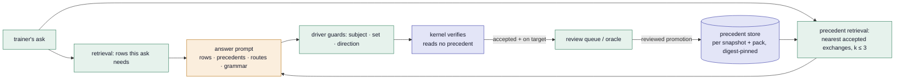

# The precedent door: memory the operator owns

This is the design for slice M1 of epic #169. It answers one question: *can
a governed agent be made consistent on the asks people type first, without
a stronger model and without one enforcement change?* The bet is a form of
agent memory — test-time, no weight update — with the one property the
architecture demands of every usefulness layer: the model never writes it,
and the verifier never reads it.

*Written 2026-09-14. The mechanism of a turn, with every model call named,
is drawn in [session-flow.md](session-flow.md); this document is the delta
M1 makes to the answer step, and the measurement that decides whether it
stays.*

## The diagnosis

The porch's simplest ask is its least consistent. Over the 24 dogfood
exchanges whose latest trainer words were "tell me about the game" (the
dev trace, 2026-09-04 → 2026-09-14, packs v2 and v3, two models):

| outcome | count |
|---|---|
| answered in one model call | 8/24 (33%) |
| first nominated a `listing` route the driver refused, then asked again | 14/24 (58%) |
| needed three calls | 5/24 (21%) |
| ended in an abstention | 3/24 (13%) — 3 of 21 on `qwen/qwen3-235b-a22b-2507`, 0 of 3 on `google/gemini-3.5-flash-lite` |

The answer, when it comes, is always the same certified lesson
(`what-is-game`). So this is not content debt, not a retrieval gap and not
a grammar gap: the lesson is in the catalogue the prompt carries, the door
is open, and the model does not walk through it on the first call. It is
the class the governance tax named as its remainder (findings,
2026-09-11): *the fact is certified; the model does not reach for it.*
The four taxed entries left on the strong model are its neighbours: on
each, the model abstains or gives prose where a certified answer exists.

The bank already holds the class as seven `meta-*` answerable entries
(`meta-what-is-game`, `meta-how-to-play`, `meta-objective`,
`meta-how-catch`, `meta-first-steps`, `meta-leveling`, `meta-is-it-hard`),
each expecting a lesson by id. They are the measurement's home.

## What the paper offers, and what transfers

Dynamic Cheatsheet (Suzgun, Yuksekgonul, Bianchi, Jurafsky, Zou — EACL
2026) keeps a short, self-curated memory of strategies and snippets that
worked on earlier tasks, rereads it on later ones, and reports large gains
on puzzles and exams with no fine-tuning. Two ideas are in it:

1. **Reuse across tasks at inference time.** A model that has seen an
   accepted answer to a nearby ask does not have to re-discover the route.
   This transfers whole: the project already has the accepted answers, in
   filed records, with provenance.
2. **The model curates the memory.** The model decides what enters and
   what it means. This does not transfer. A note the model writes about
   what "worked against the gate" is best-of-N search laundered into
   learning ([lessons.md](lessons.md), lesson 4), and a memory nobody
   reviewed is an authority nobody designated (IA-8).

So the design keeps the first idea and replaces the second with the
project's own discipline: what enters memory was accepted by the kernel and
judged on target, and a person or the bank's oracle promoted it.

## The organizing rule

> Memory is a door, not an authority. What enters it was accepted by the
> kernel and judged on target; the model never writes it; the verifier
> never reads it.

Three consequences, each a design decision below:

- A precedent is offered to the model as a worked example, next to the
  certified rows and the route catalogue — one more door in `DoorState`,
  recorded per call like every other door.
- A precedent teaches *shape and reach*, never a value. Its claims are
  shown with their ids and none of their asserted values, so a stale
  number cannot travel from an old record into a new answer.
- The store is versioned data with a loader that fails closed, promoted
  by a reviewed act, pinned by digest in every run that used it. The live
  path reads it and never writes it.

## The mechanism: one section changes in one prompt



Today's answer prompt is built by `answerPrompt` in `src/harness/advisor.ts`
from: the certified rows (retrieval or grounding), the scope, the trainer's
words, the previous subjects, the nominable routes, the tool, lesson and
rule catalogues, the dictionary, the feedback lines, and the clarify and
suggest offers. M1 adds one section between the rows and the trainer's
words:

```
Earlier asks the records answered, and the shape that was accepted for each
(examples of which door to take — never of what a value is; every value
comes from the certified rows above or is checked against them):
  - "tell me about the game"
      → {"claims": [{"kind": "explanation", "blockId": "what-is-game"}], "rosters": []}
  - "how do I catch one?"
      → {"claims": [{"kind": "explanation", "blockId": "how-catch"}], "rosters": []}
  - "what is pikachu's speed"
      → {"claims": [{"kind": "fact", "entityId": "pikachu", "factId": "base-speed"}], "rosters": []}
```

Nothing else in the prompt moves, so a run with the section and a run
without are a clean before/after — the same rule grounding and retrieval
were introduced under.

### The store

`data/precedents/<packId>.v1.json`, one file per pack id, each precedent
naming the snapshot it was accepted against:

```ts
interface PrecedentStore {
  schemaVersion: 1;
  packId: string;                 // the pack every precedent validates under
  precedents: readonly Precedent[];
}

interface Precedent {
  id: string;                     // stable, so a run names what it held
  snapshotId: string;             // never offered against another snapshot
  ask: string;                    // the trainer's own words, verbatim
  profile?: { version: string; region: string; badgeLevel: number };
  shape: {                        // the accepted draft with every value removed
    claims: readonly ClaimShape[];   // kind + ids only: no asserted, no reported, no selected, no members
    rosters: readonly ClosedRosterCriteria[];
  };
  source: {                       // provenance: where the record is
    kind: "bank-run" | "session";
    artifact: string;             // runs/coverage/…json or the dev trace / filed transaction id
    transactionId: string;
    entryId?: string;             // the bank entry it was a run of, when it was — the hold-out key
  };
  promoted: { by: "oracle" | "reviewer"; at: string };
}
```

The loader fails closed exactly as the bank's and the pack's do: a claim
kind the grammar does not have, a lesson or rule id the pack does not
carry, an entity or fact id the registry does not certify, a snapshot or
pack id that does not match — each refuses the file by name
(`precedent-unknown-kind`, `precedent-unknown-block`,
`precedent-uncertified-entity`, `precedent-world-mismatch`). A precedent
cannot be a way to smuggle an id into the prompt that the world does not
hold.

The shape strips values by construction (`shapeOf(draft)` keeps `kind` and
every `*Id` field, and drops `asserted`, `reported`, `selectedEntityId`,
`members`, `finding`, `n`). A `route` nomination is kept as a shape too:
"tell me about the species" → `{"kind": "route", "routeId": "profile", …}`
is a legitimate precedent when the driver served it.

*As built (2026-09-14, PR for M1).* Three readings of the above were
settled in the code and are recorded here so the document and the module
agree. **The pack id is the pack the store validates under**, not the pack
each record was accepted under: the shapes carry ids, not policy, and the
loader is the guard — the shipped store was promoted from the 2026-09-11
strong-model artifact (pack v2) and validates under v3 (same lessons,
same rules), each precedent's `source.artifact` pinning where it was
accepted. **A served route is not promoted as a route shape**: promotion
reads the certified manifest, which carries the composed claims, so a
profile served by nomination enters as its nine fact claims — the shape
the draft actually took — and the `followed` reading compares claims and
rosters only. **The empty step names the best score** ("best overlap 0.2,
threshold 0.25") so a dogfooder sees what the retriever almost offered;
the held step's lines carry each precedent's overlap for the same reason,
and the compliance console shows the same steps — the design's "never a
score" applies to the panel's provenance rows, not to the ledger.

### Promotion

Two sources, both reviewed acts, neither on the live path:

- **From a filed bank run.** `npm run precedents:promote -- <artifact.json>`
  reads the artifact, takes every run the kernel accepted *and* the oracle
  passed on subject and shape (the certified non-sequitur is excluded by
  construction — the oracle's subject check is the reward, exactly as H1
  requires), and writes them with `source.entryId` set. The script is
  key-free and deterministic; the diff it produces is a pull request the
  steward approves.
- **From a session.** A filed transaction a reviewer marks on target (M2's
  review queue; until then, a hand edit under review) is promoted with
  `source.kind: "session"` and no `entryId`.

A denied draft never enters. A refused nomination never enters. A draft
the driver emptied never enters. The store is a set of things that were
right, and nothing about what was wrong — the line that keeps it memory
and not search.

*As built.* The first promotion, from
`runs/coverage/2026-09-11T04-05-05-263Z-coverage.json` (the strong model,
N=3, 411 runs): **121 precedents** written, and every exclusion counted —
156 runs already in the store (the same ask accepted in the same shape on
another pass), 66 abstentions, 47 resolved runs the oracle did not pass
(off subject or off shape: the certified non-sequitur, excluded by
construction), 14 denials, 6 with no certified manifest, 1 declined act.
By door: 41 facts, 34 lessons, 15 eligibility rulings, 8 counts, 7
rankings, 7 recommendations, 4 game rules, 2 matchups, 2 memberships, 1
type count. The fixed arm's default exemplars are chosen once from the
store in order — the first lesson, the first fact, the first count — and
recorded in the artifact by id.

### Retrieval of precedents

Deterministic and lexical, so a run replays: the ask and each precedent's
ask are folded to lowercase tokens through the same hyphen-and-space fold
the row retriever uses (`retrievalSelection`), a short list of function
words removed (articles, pronouns, auxiliaries — structural, so it lints a
Pokédex and a drug label alike; no domain word, checked by the domain-word
gate), and scored by Jaccard overlap. The top `k = 3` above a threshold `0.25` are
offered, in score order, ties broken by precedent id. Both numbers are
levers recorded in the artifact, not policy in the pack: a precedent
policy belongs to the operator, not to the Accord.

A second signal breaks the tie the words cannot: when the row retriever
selected the same entity ids for the ask and for a precedent (a species
named in both), that precedent ranks first among equals. This is the only
place the two retrievers touch, and it is a preference, not a filter.

A precedent whose `snapshotId` differs from the live world is never
offered; a store whose `packId` differs is never loaded. A precedent whose
`source.entryId` matches the entry under test, or whose `ask` equals any
phrasing of that entry, is never offered — the hold-out rule, enforced in
the retriever rather than in the harness, so the live page and the bank
cannot disagree about what "held out" means.

### The record

`DoorState` gains one field:

```ts
/** The precedents this call held — empty when the door was shut or nothing
 * scored above the threshold. Held as data, not ids alone, so the trace
 * shows what the model was shown without the store in hand. */
precedents: readonly { id: string; score: number; ask: string }[];
```

so the call trace and the driver's ledger show, per call, which precedents
the prompt carried, and a precedent withdrawn on a retry (feedback rounds
keep the prompt otherwise identical, so precedents are kept) would show as
withdrawn. The coverage artifact gains `precedents: { store: string;
digest: string; k: number; threshold: number } | null` beside `retrieval`
and `gatedGrammar`, so a published number names the store it ran with, and
each run records the precedent ids it held, so the funnel can say how often
the door engaged. The `Transaction` does not change: a precedent is prompt
context, and the verdict never depended on it — which is the property
replay proves.

### The memory on the dev view

Memory is the first usefulness layer whose *state* outlives one exchange,
and a trace that showed only the prompt would hide the two things a
dogfooder needs to see: whether the door engaged, and whether the model
followed it. Both are read from the record, never narrated, in the shape
the trail already has.

**The door.** The door strip gains a seventh door, `precedents`, with the
same four states the others draw — open (k held), shut (the lever off),
withdrawn (removed for a call), and one state only this door has:
**empty** — open, and nothing scored above the threshold. Empty is drawn
differently from shut on purpose: a front door that is open and never
engages is lesson 6's silent ceiling, and the strip is where it is seen.
The caption carries the count ("3 held", "empty", "off").

**The ledger.** Four driver-lane codes, fixed and countable like the rest:

| code | text, in plain words | lines |
|---|---|---|
| `memory/held` | "3 earlier answered asks were shown as examples of which door to take; none carried a value" | one per precedent: its ask, verbatim, and its score |
| `memory/empty` | "no earlier ask was near enough to show (best score 0.14, threshold 0.25)" | the nearest miss, so a dogfooder sees what the retriever almost offered |
| `memory/held-out` | "2 precedents were withheld: they came from this same bank entry" | the withheld ids — harness runs only; the live page never sees this line |
| `memory/followed` / `memory/departed` | "the accepted answer took the same shape as the example for 'tell me about the game'" / "the accepted answer took a shape none of the examples showed" | the matching precedent's id, or nothing |

*Followed* and *departed* are computed deterministically after the
verdict: the accepted draft's stripped shape (`shapeOf`) compared with each
held precedent's shape. It is the memory's effect made visible per
exchange, and summed over a run it is the number the fixed-versus-nearest
arms are read by.

**Under the call.** The dev view's model-call block, which already opens on
the prompt and the doors, gains a precedent panel under the door strip, in
the same progressive style as the claim view: one row per precedent held —
the ask in the trainer's own words, the score, the stripped shape as it
was shown, and its provenance (the bank entry or the session it came from,
who promoted it, when). A row for a withheld precedent, greyed, with the
reason. The panel is what makes "the model never sees a value" checkable
by eye: every row shows ids and kinds, and no numbers.

**The session's memory panel.** A small panel in the dev pane, beside the
recall doors, showing the store as loaded: pack id, snapshot id, digest,
count, k and threshold. Under it, the session's own **candidates**: the
exchanges of this session the kernel accepted, each with a "mark on
target" control that appends to a promotion file the reviewer takes to a
pull request — never to the store the tab is reading. This is M2's review
queue in its smallest form, and it is where the flywheel is watched
turning: the store never changes under a running session, and the panel
says so in words.

**The compliance console.** The same steps in the League's words: "The
advisor was shown three earlier questions the records had answered, as
examples of how to answer, with no values in them", and for the
follow/depart step, whether the answer took an example's shape. The console
never shows a score.

**What the run ledger shows.** A replayed artifact draws the same door and
the same panel from the per-run precedent ids and the artifact's store
digest, so a filed leg can be read precedent by precedent after the fact;
the scoreboard adds one column per arm, *door engaged* (held / empty / off)
as count and percentage, beside the stable core.

## Doctrine, checked line by line

- **No LLM in enforcement paths.** The store is read by the advisor's
  prompt builder only. `compileManifest`, the render walk, the action gate
  and replay never see it. A test pins that the kernel's imports do not
  reach the precedent module.
- **Nothing a model emits crosses a commit boundary unverified.** A
  precedent is prompt text; the draft it influences faces the whole gate.
- **Authority is designated, never inferred (IA-8).** A precedent binds
  nothing: no scope, no consent, no value. The values a precedent's claims
  once carried are not even in the store.
- **Policy is versioned data.** The store is per pack id; a pack version
  change starts an empty store, as it starts an empty replay set.
- **Replay (IA-10).** The verdict is reproducible without the store; the
  prompt is reproducible with the store's digest, which the artifact pins.
- **No search against the gate.** Denied, refused and emptied drafts never
  enter; the live path never writes.
- **The domain-word gate.** The precedent module carries no domain word;
  the store is data.

## The measurement, pre-registered

Three arms, one artifact per model, N=3, the realistic bank
(`indigo-playability-v1`, 137 entries), the same configuration as the
2026-09-11 legs (retrieval, gated grammar, repair, profile, feedback,
clarify, suggest), with the store built from the 2026-09-11 strong-model
artifact by the promotion script and the hold-out rule on:

| arm | precedents | what it isolates |
|---|---|---|
| off | none | the baseline, re-run inside the same artifact |
| fixed | the same 3 precedents on every call, chosen once (a lesson, a fact, a count) | any few-shot effect — the gain a static exemplar gives regardless of the ask |
| nearest | the retriever's top 3 for each ask | the retrieval effect on top of the few-shot effect |

Read from the record, count and percentage together:

1. **Stable core and band**, all dispositions, per arm. The slice stays if
   *nearest* leaves the *off* band on the strong model; it is withdrawn if
   it does not, whatever the porch looks like.
2. **The class**, `meta-*` entries and the four named tax entries:
   one-call resolution per arm. Gate: at least 90% on the seven `meta-*`
   entries stably, from the dev trace's 33% one-call rate.
3. **Calls per sample** and **cost per exchange** per arm: the section
   costs tokens on every call; the number is reported beside the gain.
4. **Off-ask and no-subject first attempts** (`driver/off-ask`,
   `driver/no-subject`), per arm: the new failure a precedent could
   introduce is a shape copied onto the wrong ask. If *nearest* raises
   either count, that is the finding, and the threshold is not tuned to
   hide it.
5. **Enforcement**: 0 of N escalations on every arm, stated with the
   denominator, unchanged by construction and verified anyway.
6. **Honest disposition** on the 45 must-not-resolve entries: a precedent
   must not teach the model to answer what the records do not hold.
7. **Door engaged** (held / empty / off) and **followed / departed**, per
   arm, from the per-run precedent ids and the ledger codes above. An
   *empty* rate is the memory's activation ceiling (lesson 6) and is
   reported whatever it is; a *nearest* arm that is mostly empty has not
   been tested, only run.

A second, cheaper reading on the live path: `session:trace` with the four
dogfood phrasings of the game ask ("tell me about the game", "tell me about
this game", "telll me about the game", "I'm playing Red/blue; tell me about
the game"), ten times each, both models, *off* and *nearest*. Pennies; it
is the porch's own number.

Cost, from the last legs: about $0.30 per strong-model arm and $0.06 per
weak-model arm, so under $1.20 for the six legs, roughly five hours of
wall clock.

## What would make this wrong

- **The fixed arm matches the nearest arm.** Then the gain was few-shot
  prompting, not memory, and the honest design is three static exemplars
  in the prompt and no store. That is still a result, and cheaper.
- **The class improves and the core does not move.** Then the store is a
  porch fix and the falsifier in [generalization.md](generalization.md)
  §11 applies to it: a lever that moves only the entries it was built from
  is contamination with extra steps. The hold-out rule is what makes this
  reading available.
- **Off-ask rises.** The model over-fits the shape of a neighbour. The
  first response is a stricter threshold, reported as a second leg, never
  a loosened guard.
- **Cost per exchange rises more than the gain warrants.** Reported in
  the same table; the operator's call, with the number in front of them.

## Deliberately not built

Model-curated memory. A memory the verifier reads. Any write to the store
from the live path. Embedding retrieval of precedents (H4: live harness
only, never CI). Precedents carrying values. Precedents across pack
versions. A per-trainer memory (#145's boundary: a remembered profile may
pre-fill; only the trainer's channel binds). A precedent for a denied
draft — the wrong memory, and the one the paper's self-curation would
have kept.

## Sequencing inside the epic

M0 (the class, filed with its query) lands first as a findings entry. M1
is this document: the store and loader, the promotion script, the
retriever, the prompt section, the door and the memory panel on the dev
view, the ledger codes, the artifact field, the three arms, the findings
entry. M2 (the trainer's voice) adds the
second promotion source. M3 (the refusal fed back) reuses M1's artifact as
its instrument. M4 (the porch bank) turns the `session:trace` reading into
a band every driver PR states.
