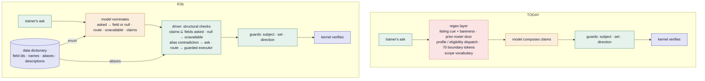
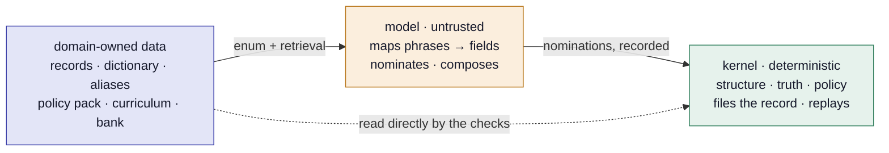

# Routing: scope belongs to the profile, routing belongs to the model

This is the plan for the epic that follows twelve front-porch rounds and
the first self-driven dogfood sessions (findings §19). It answers one
question honestly: *is the user experience going to be materially better
if we do something different?* — and the answer is yes, and not by way of
a thirteenth round.

## The diagnosis

Across every round the kernel produced **no fabrication, no wrong-scope
commit and no unauthorized act**. That half of the thesis is proven. Nearly
every defect lived in the session driver — by round twelve some 1,700 lines
of cue regexes, doors, guards, phases and stop-word lists in
`src/session/session.ts`. That layer exists for one reason: **the weak
model could not route or compose, so routing was written in regex.** The
rule "no LLM in enforcement paths" was then over-applied to machinery that
is not enforcement but *usefulness*, and the project ended up hand-rolling
a natural-language-understanding layer — the one thing a language model is
for.

The findings already hold the decisive number. On the 21-question bank,
before the deterministic routes: strong model 71%, weak model 62%. After
the routes: both 86–90%. Read plainly: **the routes did the work, not the
model — and the routes are where the bugs are.** The five wrong-shape
answers the porch produced (wrong set, wrong direction, wrong subject,
twice the wrong shape — the last on 2026-09-04, a superlative ask served
the previous exchange's listing) each came from the interaction of two
hand-written doors.

Underneath is a limit worth stating without euphemism: the Accord proves
that what is said is *true and in scope*. It cannot prove that it *answers
the question*. Relevance is routing's job. Routing by regex at the porch is
what "true but not what you asked" looks like.

## The organizing rule

> Scope belongs to the profile. Routing belongs to the model. Guarding and
> proof stay deterministic.

Three things follow, and they are the epic's slices:

1. **The trainer's scope is a setting, not a chat inference.** A version,
   region and badge count the trainer sets once, recorded on the trainer
   channel like any utterance, replayable like any evidence. This deletes
   the largest friction class outright — the version question, the cards,
   the corrections, the switch-back, the contradiction re-ask (rounds 9,
   11, 12 and both dogfood sessions were mostly this). It is also how a
   regulated product actually works: a profile, not a guess. Chat
   inference stays as an override, under the same vocabulary.
2. **Routing is nominated by a capable model and validated by the
   driver.** The route-nomination path that exists since epic #118 becomes
   the *only* dispatch: the model picks a route from the closed catalogue
   and its arguments; the driver validates; the kernel verifies.
   Nomination is untrusted and recorded, so replay and proof are untouched.
   The deterministic *guards* (subject, direction, set — they catch wrong
   certifications) stay; the deterministic *dispatch* (cue lists, bareness
   readings, prior-roster doors) goes.
3. **The demo's default model is not the control arm.** The weak model is
   a feature *of the harness* — it proves the architecture leans on nothing
   it does not control. It is a poor default for a visitor. The measured
   strong model is the default; the weak model stays the doctrine's second
   leg in every harness run.

What does not change: enforcement stays a hard zero on every run, the
crucible stays the gate, and every published number still traces to the
artifact that produced it. And "true but not what you asked" remains
*possible* with any model — the mitigation is the measured usefulness
bank, never a proof.

## The slices

Each ships its instrument; enforcement stays a hard zero; no slice is
finished while a crucible article it owes is uncovered.

### R1 — The default is the measured strong model

The shipped relay already defaults to `[DEFAULT_STRONG_MODEL,
DEFAULT_WEAK_MODEL]`; the weak-first order used for dogfooding was a local
`.env` override. R1 makes the doctrine explicit in the docs and the dev
setup, and keeps the porch usable meanwhile with the smallest possible
patch: a superlative in a catalogue ask marks it a ranking ask, never a
bare listing (the 2026-09-04 misfire).

*Gate:* the realistic bank on the default model resolves at least as well
as on the weak model, with the number filed; the superlative misfire has a
test.

### R2 — The trainer profile

A typed `profile` event on the trainer channel — `{ version, region,
badgeLevel }`, set from a panel in the live session page — binds its
dimensions on a kernel route of its own (`profile`), the way a recorded
question lets a direct answer bind: the form is the context, so no context
word and no card is owed. A profile event from any other channel is refused
by name under IA-8; a profile that contradicts a later direct statement is
a contradiction like any other, and the trainer is asked. The pack's
questions remain the fallback for a trainer who never sets a profile.

*Gate:* a crucible mutation forges a profile on a foreign channel and is
denied by name; with a profile set, the version question never fires on
the realistic bank; the ceremony count (questions + cards per resolved
answer) is filed before and after.

### R3 — Dispatch by nomination

Landed in two halves, because R2's bank leg put relevance first. **R3a
— the records' boundary** (2026-09-05): what these records do not hold
is policy the trainer can be told — a reviewed lesson plus the trainer's
words for the things outside the records (`recordsBoundary` in the
pack), answered deterministically before any model reads the ask; and
abstention representable in-grammar (`unavailable`), lifted out by the
decoder and reported as the boundary, never certified. The bank scorer
reads a record that taught the boundary lesson alone as the honest pass
it is. (Both halves were superseded on the same day by R3b's schema
linking below: the tokens are deleted, and the abstention is now a `none`
link in the `asked` mapping rather than a grammar variant of its own; the
lesson and the scorer's reading of it stay.) **R3b** is the rest of this slice: a recovery for the strong
model's concept-noun fabrications (a fact about "gym badge" as if it
were an entity — refused rightly under IA-3, the lesson left untaught),
counted apart like the strip-assertion repair; and the dispatch
retirement below.

The listing cue dispatch, the bareness reading, the prior-roster door, the
deflected-profile dispatch and the eligibility dispatch are retired as
*dispatch*; each survives only as (a) an executor the model can nominate
and (b) a guard the driver applies to whatever the model composed. The
activation gauge (round eight) is repurposed to count nominations by route
and their validation outcomes, so a route the model never picks is as
visible as a door that never fired.

*Gate:* usefulness on the realistic bank, default model, at least current;
enforcement zeros; each of the five wrong-shape classes pinned by a bank
entry or mutation as denied-or-abstained, never certified-wrong; the
driver's cue-list count and line count filed before and after.

### R3b design — schema-linked routing

> **In one sentence:** the model links each phrase of the ask to a field of
> the domain's schema (*schema linking*, in the text-to-SQL sense); the
> driver checks the answer against that link (*structure*, not words); the
> schema's aliases can contradict a link but never make one. What it
> replaces is *lexical routing* — cue lists and regexes deciding an ask's
> shape from English before the model sees it.

*Naming.* "Schema linking" is the standard term from text-to-SQL research
for linking spans of a question to schema elements (IRNet, 2019; RAT-SQL,
2020); the dialogue-systems cousin is slot filling against an ontology; the
industry names are schema grounding and structured outputs. The artifact
the domain supplies is its **data dictionary** — one entry per certified
field: id, name, one-line description, aliases, value kind — in the plain
database sense. Earlier drafts and the published design page called this
"routing by dictionary"; the mechanism is unchanged, the name was.

*Written 2026-09-05, after the reflection that a fixed English token list
cannot be the mechanism a bank or a hospital re-tunes per domain. The
mechanism of a turn, with every model call named, is drawn in
[session-flow.md](session-flow.md); this section is the delta R3b makes to
it, and the instrument that proves the delta transferred.*

**The claim.** Onboarding a domain is authoring its data — dictionary,
aliases, policy, curriculum, a reviewed question bank — and zero lines of
routing code. Checkable per commit (the domain-word gate) and per domain
(the effort ledger).

**Where the claim stands.** Compliance is proven and usability is measured;
adaptability has one data point (the Center port: ≈3 agent-days against a
33-human-day pre-registered budget, ~80% data — [port-log.md](port-log.md))
and one hidden liability the port never priced, because it accrued in the
twelve porch rounds afterwards: the session driver is 2,155 lines with 33
Pokémon-specific literals inside regexes and strings, nine cue constants,
and — as of R3a — seventy boundary tokens. Each is a line a medicine team
would rewrite by hand.

**The mechanism: one layer changes.**



The regex layer decided an ask's *shape from English* before the model saw
it. Under R3b the model nominates — for each phrase, the certified field it
read the phrase as, or `null`; plus routes and `unavailable` — against an
enum built from the domain's **data dictionary**, and the driver checks
*structure*, not words. The guards and the kernel are untouched.

**The trust boundary does not move.** The dictionary is domain-owned data;
the kernel and the driver's checks read it directly; the model sits between
the ask and the checks as recorded, untrusted nominations. That is why the
dictionary's aliases can *cross-check* the model's mapping rather than trust
it.



**The dictionary is a data product the domain already has.** FHIR element
definitions, ISO 20022 component names, a fund fact-sheet's field glossary.
Per certified field: id, name, one line of description, aliases. Where the
registry's ids are mechanical (`base-speed`, `move-power`) the name and first
aliases are derived; the description and long-tail aliases are one human
line per field — O(fields), not O(phrases), authored by the domain team.

| field id | name | aliases (derived + authored) | description | kind |
|---|---|---|---|---|
| `base-speed` | Speed | speed, base speed, how fast, faster, fastest, quick | The species' base Speed stat. | numeric |
| `learnset` | Moves it learns | learn, learns, moveset, can it use | Every move the species can learn in this version. | list |
| `locations` | Where to find it | where, catch, find, encounter, route | Areas where the species is encountered. | list |
| `boxed_warning` | Boxed warning | black box, warning, serious risk | The FDA boxed warning text, verbatim. | text |
| `dosage_and_administration` | Dosage | dose, how much, how often | Approved dosing from the label. | text |

The last two rows are the same table for openFDA drug labels — the third
world below. The mechanism does not change between the rows; the data does.

**The grammar change.** One addition, always offered: per thing asked, the
field the model resolved it to, or `null`; the enum is built from the
dictionary at call time like lesson ids and rule ids already are.

```json
{
  "asked": [
    { "phrase": "how tall", "entityId": "onix", "fieldId": null },
    { "phrase": "what it evolves into", "entityId": "onix", "fieldId": "evolves-to" }
  ],
  "rosters": [],
  "claims": [ { "kind": "fact", "entityId": "onix", "factId": "evolves-to" } ]
}
```

The mapping is a nomination like any other — untrusted, recorded in the
transaction, replay-free — and auditable: the record shows what the model
thought "how tall" meant.

**The structural checks that replace the word-lists** (none contains a
domain word):

- **R1 Claims stay inside the ask.** Every claim's field must be a mapped
  field in `asked`; an off-target claim is dropped and counted; nothing
  left → honest pass. "True but not what you asked" becomes unrepresentable
  given the mapping.
- **R2 A null mapping is the records' boundary.** Each `fieldId: null`
  becomes the unavailable note in the trainer's own phrase — the R3a
  lesson, triggered by structure instead of seventy tokens.
- **R3 Aliases cross-check the mapping.** A phrase containing an alias of a
  *different* field than the one mapped is a contradiction: the trainer is
  asked which they meant. The only place the dictionary's words touch the
  driver, and it can only make the system ask, never answer.
- **R4 No mapping and no subject is off-domain.** The redirect, as today.
- **R5 Routes are nominations with guarded executors.** Listing, profile and
  eligibility survive only as executors the model names, each with the
  guards R1 gave them; the cue dispatch in front of them is deleted.

**Clarification and follow-up: the model may ask, the trainer's pick binds.**
Pushed back on 2026-09-05, rightly: an agent that can only ask the pack's
fixed questions and never a question of its own feels dumb, and one that
never offers a next step feels dumber. The earlier "deliberately not built"
line treated a model-phrased question as a warmth-for-auditability trade;
that was the wrong cut. The auditable part of a question was never its
*wording* — it is what the answer *binds to*. So:

- **A clarification is a nomination with typed options.** The grammar gains
  `{"kind": "clarify", "about": "<phrase>", "question": "<text>", "options":
  [{"label": "...", "fieldId": "..." | null} | {"label": "...", "dimension":
  "...", "value": ...}]}`. The question text is the model's (shown in the
  Advisor's voice, recorded verbatim, never a claim); the options are typed —
  a certified field or `null`, or an approved scope value — so a pick is a
  binding the kernel can verify. This generalises "the question is the
  context": a recorded clarification arms the answer route exactly as the
  pack's question does, for the option the trainer picks by click or by words
  matching an option's label or alias.
- **When the model asks.** An alias contradiction (R3 above) becomes a
  model-phrased question with the two fields as options instead of a stock
  line; an ambiguous subject ("the fast one") a question naming the
  candidates; a scope gap a warm version of the pack's question with the
  pack's values as options. The pack's fixed question stays as the fallback
  when the model offers nothing usable — never the default it is today.
- **A follow-up is a suggestion, not a claim.** `{"kind": "suggest", "asks":
  ["what it's weak to", "where to catch it"]}` renders as chips in a
  labelled *suggestion* register (the affidavit attributes them as the
  model's, uncertified, like the trainer's own words); clicking one sends it
  as the trainer's utterance. A suggestion asserts nothing — it is a question
  the trainer may ask — so IA-4 has nothing to check; text closure requires
  only that the register is labelled, which it is.
- **Guards, deterministic:** a clarification with no typed option is dropped;
  an option naming a field or value outside the enums is unrepresentable in
  the grammar and dropped if it arrives; at most one clarification per turn;
  a suggestion containing a number or a certified id is dropped (a suggestion
  may name a topic, never a value). Counted: clarifications asked, picked,
  ignored; suggestions shown, taken.

**Two bounded rounds, and no more: the loops R3b adds.** Asked on
2026-09-05: nothing so far loops with the model — one discovery call, one
answer call, two narrow recoveries (the route-door-closed retry, the
deterministic strip-assertion repair), and a ladder that loops with the
*trainer*, never the model. Yet the kernel produces exactly the signal a
retry needs and throws it away: a denial says precisely why, by name. In
R1's N=3 leg, 21 of 411 samples died as `IA-3/fabricated-entity` on
concept nouns ("gym badge" proposed as a species) — every one a question a
carried lesson answers.

- **The verifier-in-the-loop retry.** On a kernel denial that is not a
  fact mismatch (the repair owns those), one more model call carrying the
  named violation in fixed wording and a pointer at what *is*
  representable — the closed lists the prompt already holds. A second
  denial files as today. *Extended 2026-09-06 to the driver's own
  refusals:* a reply the linking step empties — every claim dropped as off
  the ask or about no subject, where the model had written something — is
  carried back the same way (`driver/no-subject`, `driver/off-ask`), on the
  discovery hop as well as the answer hop; a reply the model itself left
  empty is not, since there is nothing to correct. Still one round: the
  second reply is read by the same step with no further retry, and the
  kernel's own round does not run after it. Counted as `feedbackRetries`, reported beside
  `repairs` and `nominationRetries`; first-attempt, post-repair and
  post-feedback resolutions are never blended, so the enforcement number
  keeps measuring first attempts and the loop's credit is usefulness's.
- **Bounded clarification chains.** Clarify → pick → answer is the design
  above; one further clarification on the same ask is allowed (an
  ambiguous subject after an ambiguous field), capped at two per ask like
  the ladder's cards, so the bot can ask twice and never interrogate. The
  cap is a constant beside `MAX_LADDER_TURNS`, and a chain that hits it
  falls to the honest pass naming what stayed ambiguous.
- **A reasoning-mode experiment, not a commitment.** Whether a thinking
  mode before the JSON improves the `asked → field` mapping is a per-field
  number one bank leg produces. If it does, it is a provider flag recorded
  in the artifact; if it does not, that is filed too.

Why this is safe where an agent loop would not be: every round is
re-verified by the kernel, so a loop can only turn a denial into a
certified answer or an honest pass — a second fabricated entity is refused
like the first, and there is no passing by trial and error; every round's
completion is in the record, so IA-10 replay holds; and the feedback text
is derived from the violation by fixed wording, never free prose. What is
deliberately not built: an open-ended plan/act/reflect agent. In a closed
world with a verifier the kernel already says when to stop and why; a
round costs about two seconds on the strong model and a longer record,
and two bounded rounds — one for shape, one for repair — is the whole
budget this design needs.

**What is deleted, and what replaces it.**

| today (driver code) | size | under R3b |
|---|---|---|
| listing verb/wh/noun cues, stop-words, bareness reading | ~180 lines | listing nomination + qualified-set executor guard (kept). *Cues deleted 2026-09-05; the bareness reading stays as the executor's guard.* |
| prior-roster door, answer-hop listing door | ~60 | `subject: prior-roster` nomination; executor guard (kept). *Both doors deleted 2026-09-05.* |
| deflected-profile dispatch | ~40 | profile nomination; move-naming guard (kept) |
| eligibility cue (`ADVISORY_WORDING`) | ~30 | eligibility nomination; the pack's restriction rules decide (data) |
| `recordsBoundary` tokens | 70 tokens | R2: null mapping → unavailable; the lesson stays (data) |
| direction cue, superlative list | ~25 | direction stays a guard on the composed claim; the superlative list dies with the bareness reading |
| scope vocabulary | pack data | optional: the profile is the production path (R2); chat inference stays as an override, still data |
| question openers, interpretation furniture, social cues | ~90 | English function words and social register, not domain words — allowed by the gate by name |

**The gate: no domain word in the routing path.** A CI test
(`src/testing/domain-words.test.ts`) that reads every string, template and
regex literal — never a comment — in the files whose literals decide an
ask's shape (the driver, the propose steps' prompt and grammar, the decoder,
the retrieval front door, the scope vocabulary's reader; the list is
`ROUTING_PATH`) and counts the ones naming the domain. The word list is
derived, not written: every species, move and item id and type name in both
snapshots, the packs' version and region tokens, and the world nouns the
pack's copy uses ("Pokémon", "badge", "gym", "League", the rarity words). The
count is pinned and ratchets down only: going up fails as "move it to
data", going down without the pin fails as "lower the pin", so the ledger
reads per commit. Landed 2026-09-05 at **90 sites** — 38 in the driver, 33
in the retrieval front door's hand-written item lexicon, 13 in the answer
prompt's copy, the rest in the grammar, the gate cue list and the scope
reader's denial text. (The design's earlier "33" counted the driver's
regexes alone.) The crucible's world transcripts, the demo script, the
harness corpora and the app's copy are this world's test data and copy, not
routing, and are outside the path by name. R3b drives the number to 0 and
it stays there. It is the instrument the activation counter was; a green
gate on the Pokémon world is what lets the next world start from the same
zero.

**The effort ledger, and how X% gets a number.** The port log's
pre-registered budget per seam gains a category column:

| category | what | who pays | target |
|---|---|---|---|
| core | kernel, driver, harness, app, crucible mechanics | nobody, per domain | 0 days · gate green |
| owned data | records, data dictionary, alias tables, existing policy | ingest only | days to map, not to author |
| authored data | certification review, curriculum, consent wording, bank + oracles, restriction rules | the domain team | the whole bill |
| typed widening | new claim kinds / roster criteria as types (`contraindication` where Pokémon had `matchup`) | engineering, bounded | counted, reviewed, loud by design |

Then a third world that is not Pokémon: **openFDA drug labels** — public,
structured (indications, dosage, warnings, contraindications), a real alias
table (RxNorm), a real disclosure rule (a boxed warning beside any dosing
answer) that maps onto IA-6 directly. Budgeted per seam before it starts,
ledger filled as it lands, gate at zero throughout, the bank written by
"the domain team", usefulness produced by the bank on day one. X% is then
engineering days ÷ total days, against the 30-human-day prior the playbook
re-derived.

**R3b's gate, as numbers.** Domain literals in the routing path: 90 → 0.
Needs-data honest passes: at least R3a's 70%, now structural. Answerable
resolution on both models: at least the current band. Enforcement: zero on
every leg. Off-target claims dropped, alias contradictions asked, feedback
retries taken and clarification chains capped: counted and filed. Both models per the doctrine — the weak model rarely
nominates, the strong model sometimes mislabels — with the bank's
per-field oracle telling those apart.

**Sequencing, with the dogfood stops marked.** Every stop below is a
point where the live page (`npm run app:dev`, relay on :8080) carries the
slice and the question to answer is the only one that matters: *does it
still feel dumb?* A bank leg follows a stop, never replaces it — the two
slices before this one were measured before they were driven, which is the
wrong order for a "feels dumb" problem.

1. **Gate** (one commit; pinned at 90 — the baseline). No stop. *Landed
   2026-09-05.*
2. **Schema linking: the data dictionary + the `asked` mapping + the five
   checks**, boundary tokens
   deleted, and **the verifier-in-the-loop retry** (small enough to ride
   here). → **Dogfood stop 1:** "how tall is Onix?", "what egg group",
   "what's its Speed?", "what type is it?" — substitutions gone without a
   word-list; the honest pass names what was asked; "what's a gym badge?"
   teaches the lesson on the second round instead of dying on the first.
   *Landed 2026-09-05:* the dictionary lives in the pack (`dictionary`, 24
   entries in the standard world, 40 in the Center's; the loader pins it to
   the registry both ways and refuses a shared alias within a subject), the
   grammar carries `asked` over the dictionary's ids plus the reserved
   `none`, the decoder reads a `none` link as the abstention R3a's grammar
   variant carried (that variant is retired), and `src/session/linking.ts`
   holds the checks: R1 drops off-target field claims and counts them, R2
   teaches the boundary lesson from a null link, R3 turns an alias
   contradiction into a question and never an answer, read per the subject
   the ask names (a move's word is no evidence about a species). The
   feedback retry is `SessionDeps.feedback` — on in the live page and the
   tracer, off in the banks until their leg — with the first denial kept in
   `feedbackDenials`. The seventy tokens are gone; the gate reads 77 with
   the listing door's deletion below. Numbers in findings §19 ("R3b, first
   slice"): 97/137 on the strong model with the retry on, needs-data 74%,
   honest refusal 71%, enforcement held.
3. **Clarification nomination**, the model-phrased scope question, and the
   two-per-ask chain cap. → **Dogfood stop 2:** ambiguous asks ("the fast
   one", "is it strong?") get a real question with real options; a second
   question is allowed and a third never asked; the version question stops
   sounding like a form. *Landed 2026-09-05:* the answer grammar gains the
   `clarify` nomination — a question in the model's words about one phrase,
   with options typed as a dictionary field (or `none`) or a certified
   subject — behind `SessionDeps.clarify` (on in the live page and the
   tracer, off in the banks until their leg). The question is a
   `clarification` transcript event the kernel reads only as a change of
   subject; the pick is read against the options by label, by the
   dictionary's aliases or by the subject's name (a subject question
   answered with a certified subject the model did not list is a pick too),
   and binds at linking: a field pick holds every claim to that field (or
   teaches the boundary for `none`), a subject pick drops claims about any
   other certified subject. An alias contradiction becomes the same kind of
   question with the fields as options — driver-worded, since the fields
   and the phrase are all it needs — where before it was a stock line and a
   closed exchange. The pack's fixed scope question is put to the model to
   phrase in the light of the ask (`phraseQuestion`, one small call; the
   text is held to a structural guard — one sentence, a question mark, no
   digit — and the pack's line is the fallback), armed for the same
   dimension with the vocabulary's values as clicks, so a bare "red-blue"
   binds as it always did. `MAX_CLARIFICATIONS = 2` per ask; the third
   falls to the honest pass naming what stayed ambiguous. Counted:
   `clarification.{asked, picked, ignored, capped, phrased, unphrased}`.
   The gate stayed at 77; `src/session/clarify.ts` is in its path. Numbers
   in findings §19 ("R3b step 3").
4. **Follow-up suggestions.** → **Dogfood stop 3:** every answer offers a
   next step; the conversation has a shape instead of a series of dead
   stops. *Landed 2026-09-06:* the answer grammar gains a `suggest` entry
   (up to three short questions in the trainer's voice) behind
   `SessionDeps.suggest` — on in the live page and the tracer, off in the
   banks. The suggestions are not claims and are never certified; they are
   *shown*, so they travel in the manifest (`suggestions`) and render on
   the certified page in one labelled register — a `suggestions` unit whose
   lead-in is the pack's own copy ("the Advisor's own ideas, not certified")
   and whose items carry a `data-suggestion` mark the walker attributes to
   the model. The affidavit swears to the register's visibility like any
   unit's; the verifier holds each mark to the manifest's text by equality
   (drift, an extra, a missing or a hidden one, or a mark outside the
   register, each refused by name under IA-6); and the topic-not-value rule
   is one function at two gates (`suggestionProblem`: no digit, no
   certified id of any kind) — the driver drops offenders so a bad
   suggestion never costs a certified answer, and the kernel refuses any
   that reach a manifest (IA-2 `suggestion-states-value`,
   `suggestion-names-subject`). The live page makes the latest answer's
   items clickable: a click says the suggestion back as the trainer's own
   words, counted as `taken`. Counted:
   `suggestions.{offered, kept, dropped, taken}`. The mount allows no
   button, so the register is list items the page wires. Numbers in
   findings §19 ("R3b step 4").
5. **Delete the dispatch doors one at a time**, a bank leg after each so a
   regression names its door. → **Dogfood stop 4** after the listing door
   goes (the porch's most-trodden path). *The listing cue door went first,
   on 2026-09-05, ahead of its turn: the first schema-linking run showed it
   reading "what beats water types?" as a listing and serving the water
   roster before any model saw the ask — a certified wrong shape the new
   R1 check could only have caught on the model path. Its executor and
   guards stay as the `listing` nomination; the gate read 77 after.*
6. **Both-model legs**, N=3 on the strong model, plus the reasoning-mode
   leg as an experiment; findings filed with `feedbackRetries` beside
   `repairs`; the gate at 0.
7. The openFDA epic, budgeted before it starts.

**What would falsify it.** If, with the data dictionary in place, the strong model
mislabels phrases at a rate the alias cross-check cannot catch — "how
heavy" mapped to `base-hp` with no alias evidence either way — relevance
needs judgment the kernel cannot verify, and the product claim narrows to
*certified-true; relevance measured, not guaranteed*. The bank produces
that number per field. What this slice cannot falsify: the compliance
zero, which none of it touches.

### R4 — The ceremony audit

With R2 and R3 in, measure what ceremony remains — questions, cards,
restatements per resolved answer on the bank — and set the ceremony dial's
defaults from the number rather than from taste.

*Gate:* the ceremony instrument is in the results page; the defaults are
stated with their number.

## Sequencing

R1 immediately — one commit. R2 next: the largest experience gain for the
least code, and it removes the friction R3 would otherwise have to route
around. R3 is the core and the largest. R4 closes. This epic pulls S3/S4
of [scale.md](scale.md) forward because the porch demands them, not
because scale does; the two plans share the invariant that nothing
nondeterministic ever gates proof.

## Deliberately not built

~~A model-phrased clarifying question.~~ Reversed 2026-09-05 — see the R3b
design: the wording was never the auditable part, the binding is, and a
clarification with typed options keeps the binding while giving the
question a voice. A per-user memory of scope across sessions (a profile is a
setting the page keeps, not a record the kernel owns). Any relaxation of
the closed route catalogue.
