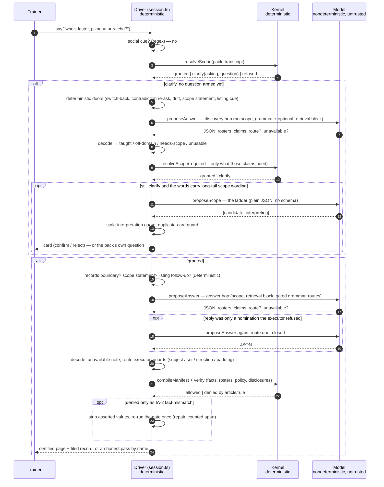
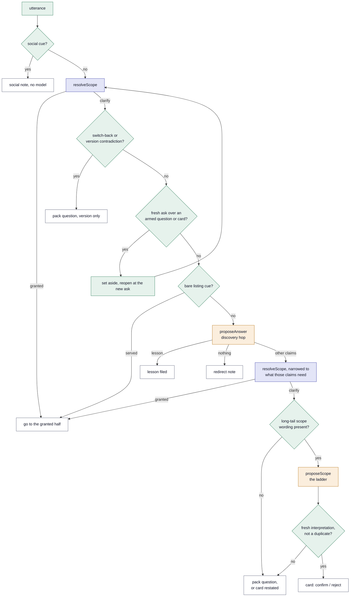
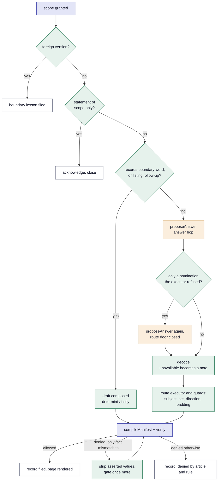
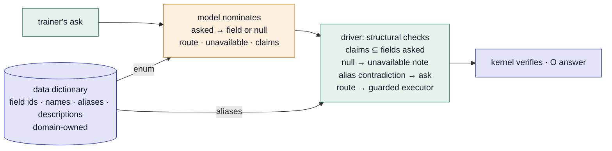

# The live session, end to end: where the model speaks and where it never does

This is the mechanism of one conversation turn in the live session
(`src/session/session.ts`), drawn so a cold reader can see which steps are
deterministic functions of the record and which are calls to a model — and
what each model call is shown, what grammar it must reply in, and what
happens to its reply. It sits beside [architecture.md](architecture.md)
(the shape) and [routing.md](routing.md) (the plan for the routing layer);
the diagrams here are the ones that plan reasons about.

One sentence holds the whole design: **the model may only propose, every
proposal is recorded, and nothing it proposes reaches a record without a
deterministic verification that reads the certified data itself.** A filed
transaction replays without any model present (IA-10) because every model
completion is in the record and every verification is a pure function of
the record, the snapshot and the pack.

## 1. One turn, as a sequence

Everything on the driver and kernel lanes is a pure function of the
transcript, the pack and the snapshot. The model lane is the only source
of nondeterminism, and each of its replies is recorded verbatim in the
transaction (`completions`), which is why the record replays without it.

## 2. The driver's decision tree for one utterance

Two diagrams, because the tree has two halves that never meet: what happens
while scope is still being gathered, and what happens once it is granted.
Green is deterministic driver logic, indigo is the kernel, amber is a model
call.

**Before scope is granted — gathering.** The deterministic doors run first;
the model is asked only to learn the answer's *shape*, and the ladder only
when the trainer's words carry scope wording the vocabulary cannot read.

**After scope is granted — answering.** Two deterministic drafts can
pre-empt the model (the records boundary, a listing follow-up); otherwise
the model composes, the guards trim, the kernel rules, and one repair may
re-run the gate without a model.

There are exactly four amber nodes across the two halves; §3 lists what
each is shown. Note where the amber nodes sit: always *between* deterministic
checks, never adjacent to a record. A record is only ever written by the
kernel node or by a driver note that files nothing.

## 3. Every model call the live session can make

| # | purpose | when | prompt (see §4) | grammar | what the reply becomes | if the reply is bad |
|---|---|---|---|---|---|---|
| 1 | `answer` — discovery hop | scope not yet granted, no question armed, the deterministic doors stood down | answer prompt with **"Scope is NOT established yet"**; retrieval block when `retrieval` is on | `answerSchema` (+ `route` variants, + `unavailable`; filler kinds gated by the cue) | a lesson commits at once; anything else is read as *intent* and names the scope to establish | unreadable → fall to the version floor; empty → off-domain redirect |
| 2 | `scope` — the ladder | clarify, a question is not the better move, the words carry long-tail scope wording | scope prompt: the trainer's lines, the missing dimensions, the approved values | none (plain JSON asked; decoded by `decodeCandidate`) | an untrusted `proposal` event; binds only on the trainer's confirmation | malformed or stale → the pack's own question |
| 3 | `answer` — answer hop | scope granted, no deterministic draft | answer prompt with **"Scope is established: …"**; retrieval block; `previously` for anaphoric asks | as #1 | decoded draft → executor/guards → kernel | malformed → honest pass; token cap → truncation named |
| 4 | `answer` — route-door-closed retry | #1 or #3 replied with only a nomination the executor refused | same prompt, `routes` omitted | as #1 minus the route variants | as #3 | as #3 |

Not in the live session: `proposeRawAnswer`, the harness's ungoverned control arm (same question, same grammar, no kernel), which exists so a published number has its comparison leg.

What every call shares (`src/harness/openrouter.ts`): a fixed **system
persona** (`HONEST_PERSONA`; the adversarial persona is a harness setting
for red-team runs), `temperature: 0` — *requested and not relied upon*,
providers diverge at 0 — a `max_tokens` cap, and for the answer calls
`response_format: json_schema, strict: true` so the provider enforces the
grammar at decode time (folded per provider where one rejects a keyword,
e.g. `maxItems` for Google models, with the cap re-enforced by the
decoder).

## 4. The prompts, section by section

Both prompts are pure functions of recorded inputs (the pack, the
registry, the transcript slice, the scope, the door flags). No clock, no
environment, no hidden state — the same inputs always build the same
bytes, which is what makes a filed run reproducible.

### The answer prompt (`answerPrompt`, calls 1, 3, 4)

In order:

1. **The retrieval block** (when `retrieval` is on — the product default).
   `retrieveReference` lexically selects the species and moves the ask
   names and prints their certified rows: `charizard | 6 | fire,flying |
   … | 78 84 78 109 85 100`, the learnset, and any move rows. Facts only;
   never policy. The block says: *cite these; do not answer from memory.*
   Grounding changes what the model is asked, never what may commit — the
   kernel recomputes every value regardless.
2. **Scope status.** Discovery: "Scope is NOT established yet … a lesson
   can be certified right now; any other claim is read as intent … small
   talk gets no claims … when a built-in door fits, nominate it." Answer
   hop: "Scope is established: version=… region=… badges=…".
3. **Earlier words**, only for an anaphoric ask ("can you list at least
   10 for me?"), labelled as context, not the ask. Trainer channel only.
4. **The trainer's own words** — the current exchange's utterances,
   nothing else. Only the trainer speaks for the trainer (IA-8).
5. **The contract.** Answer what was asked and assert nothing unrequested
   (an unrequested claim is one more thing that can be wrong, and one
   wrong claim refuses the whole answer); omit rather than guess; at most
   twelve claims and four rosters; prefer the most specific claim kind.
6. **The shape**: one JSON object `{rosters, claims}`; the roster
   criteria vocabulary (`has-type`, `learns-move`, `rarity`,
   `stat-at-least`…; `{"all": []}` is the whole certified set).
7. **The claim catalogue**, one line per kind with its rule: `fact`
   (name it, the kernel reads the value), `count`, `gameRule`,
   `membership` (how to list), `comparison`, `ranking` (the system names
   the winner), `matchup` (direction follows the question, not the
   subject), `eligibility` (the rule itself is a useful answer),
   `explanation` (a reviewed lesson, last resort), `recommendation`,
   `action` (executes only on consent), and since R3a `unavailable`
   (what the records do not hold, in the trainer's word — never
   substitute).
8. **The nominations**, when offered: the route catalogue (`listing`,
   `profile`) with each route's description and arguments — the door, not
   the work.
9. **The closed lists**: lesson ids, rule ids with what they count, tool
   ids, and the certified fact ids per entity kind — *ids, never values*.
   An id outside these is unrepresentable in the grammar and refused by
   the kernel if it somehow arrives.

What is deliberately **not** in the prompt: any fact value, any count,
any policy threshold. The prompt describes a contract; the content the
model asserts is still its own, so the usefulness number measures the
model and the enforcement number measures the kernel.

### The scope prompt (`scopePrompt`, call 2)

Short by design: the trainer's lines, "Still unestablished: version,
…", the instruction to propose one approved value per dimension *from the
trainer's own words*, quoting the exact wording it is reading in
`interpreting`, and the approved values per dimension. The reply is a
`proposal` event that binds nothing until the trainer confirms it — and
the driver holds the model to its own label: an interpretation whose
substantive words are not in this exchange is stale and is discarded.

## 5. What is deterministic, listed

Every one of these reads only the record, the pack and the snapshot, and
is covered by offline tests with scripted models:

- scope resolution and every block rule (channel, quoted, reported,
  instruction, negation, question, unconfirmed, rejected, digest,
  unapproved, superseded); the profile and answer routes; contradiction
  → question
- the social register, the switch-back and contradiction re-ask, the
  drift door, the scope-statement acknowledgment, the listing cue door
  and its bareness reading, the records boundary, the deflected profile
- decoding (shape only — a well-formed lie passes through to the kernel
  on purpose), the fold of self-comparisons, the claim budget
- the route executors and their guards; the wrong-set, direction and
  padded-lesson guards; the eligibility route
- the manifest compile and every verification (facts against the
  snapshot, rosters recomputed, policy gates, mandatory disclosures,
  text closure, the render affidavit); the strip-assertion repair
- replay: a filed transaction re-verifies byte for byte with no model

And the nondeterministic list is §3's four rows. That asymmetry is the
architecture: usefulness lives in the amber nodes and is measured;
enforcement lives everywhere else and is proven.

## 6. What R3b changes in this picture

[routing.md](routing.md) R3b removes the deterministic *dispatch* doors
(listing cue, prior-roster, deflected-profile dispatch, boundary tokens)
and adds one thing to the answer grammar: the model must declare, per
phrase asked, which certified **field** it read the phrase as — from an
enum built from the domain's data dictionary — or `null`: *schema linking*,
in the text-to-SQL sense. The driver then
checks structure (claims inside the fields asked; `null` → the records'
boundary; an alias contradiction → ask) instead of English. The amber
nodes stay four; the green nodes lose their domain words; the kernel is
untouched.

The full design — *schema-linked routing*, with the effort ledger and the
third-world plan that makes the onboarding claim measurable — is the R3b
section of [routing.md](routing.md).
